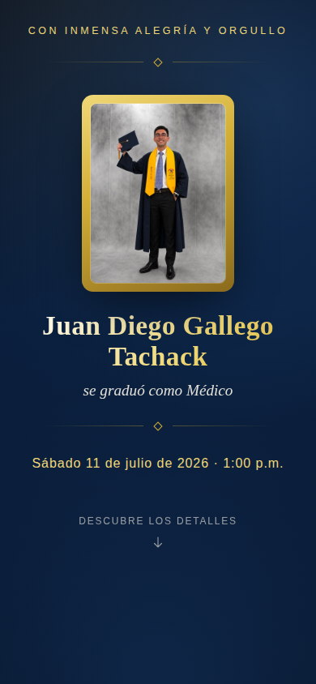

# 🎓 Grado de Juan Diego

<p align="center">
  <a href="https://gabotachak.github.io/grado-juan/">
    
  </a>
</p>

<p align="center">
  <a href="https://gabotachak.github.io/grado-juan/"></a>
  <a href="https://github.com/gabotachak/grado-juan/actions/workflows/deploy.yml"></a>
  
  
  
</p>

<p align="center"><b>👉 <a href="https://gabotachak.github.io/grado-juan/">gabotachak.github.io/grado-juan</a></b></p>

Invitación web para celebrar el grado de Médico de Juan Diego Gallego Tachack — una sola página, tematizada en azul marino y dorado (los colores de su toga y su estola), pensada para compartirse por WhatsApp y verse igual de bien desde el celular de la abuela que desde un laptop.

<p align="center">
  
</p>

## ✨ Qué tiene

- 🖼️ Hero con foto en marco dorado, tipografía serif elegante y contador de días en vivo
- 💬 **Confirmar asistencia** en un toque, con mensaje de WhatsApp pre-armado "a la vista" (fecha, hora, lugar y mapa)
- 🔗 Meta tags OG/Twitter cuidadas para que el link luzca bien y con contexto al compartirse en WhatsApp/iMessage
- 📱 Responsive de verdad, afinado contra las rarezas de Safari en iPhone (barra inferior, safe areas)
- ⚡ Cero JavaScript framework — HTML/CSS estático servido por Astro, carga instantánea

## 🛠️ Stack

| | |
|---|---|
| Framework | [Astro](https://astro.build) 6 (sin frameworks de UI, solo `.astro` + CSS) |
| Estilos | CSS puro con custom properties, sin Tailwind |
| Hosting | GitHub Pages |
| CI/CD | GitHub Actions (`actions/upload-pages-artifact` + `actions/deploy-pages`) |

## 🤖 Vibe coded

Este sitio se construyó por completo conversando con **Claude** (Claude Code): desde el scaffold inicial de Astro hasta el ajuste fino de la animación del scroll-cue, el copy de cada sección y la posición exacta de un botón. Cero líneas escritas a mano — puro ida y vuelta en lenguaje natural, screenshots del celular incluidos para debuggear UX en vivo.

## 📦 Desarrollo local

```sh
npm install
npm run dev
```

## 🏗️ Build & preview

```sh
npm run build
npm run preview
```

## ☁️ Despliegue

Cada push a `main` dispara `.github/workflows/deploy.yml`, que compila el sitio y lo publica en `https://gabotachak.github.io/grado-juan/` vía GitHub Pages (Settings → Pages → Source: **GitHub Actions**).

---

<p align="center">
  Hecho con cariño por <a href="https://github.com/gabotachak">@gabotachak</a> · <a href="https://gabotachak.dev">gabotachak.dev</a>
</p>
